<a href="https://codewithmashi.github.io/codewithmashi/">
  <picture>
    <source media="(prefers-color-scheme: dark)"  srcset="assets/hero-dark.svg">
    <source media="(prefers-color-scheme: light)" srcset="assets/hero-light.svg">
    
  </picture>
</a>

 

**Mobile &amp; AI-automation engineer.** I build apps that ship and pipelines that run without me.

    

↑ the banner is a real 3D wireframe — <a href="https://codewithmashi.github.io/codewithmashi/">open the interactive WebGL version</a>

---

### What I'm building

| | Project | What it does |
|---|---|---|
| 🧠 | **[NoteGent](https://notegent.vercel.app/)** | AI note generation — turns messy input into structured, usable notes. |
| ⚙️ | **Content Factory** *(private)* | Fully autonomous video pipeline: research → script → render → publish → learn. Four channels, zero manual steps, running daily on Modal. |
| ✅ | **[DoFlow](https://github.com/codewithmashi/DoFlow-Release)** | Productivity app — task flow that doesn't get in your way. |
| 🛒 | **[Complicit](https://play.google.com/store/apps/details?id=app.complicit.android)** | Product boycott app. Scan a product, see who owns it. |

I work mostly in **Flutter** on the front, **TypeScript/Node** and **Python** on the back, with a lot of time lately in autonomous agent pipelines — queues, workers, schedulers, and the unglamorous recovery paths that keep them alive when a cloud container gets preempted at 3am.

### Stack

           

 

<picture>
  <source media="(prefers-color-scheme: dark)"  srcset="assets/stats-dark.svg">
  <source media="(prefers-color-scheme: light)" srcset="assets/stats-light.svg">
  
</picture>

Generated from the GitHub API by <a href=".github/workflows/refresh.yml">a scheduled Action</a> and served from this repo — no third-party card service to rate-limit or disappear.

---

Dubai, UAE · open to collaboration on mobile products and automation systems

